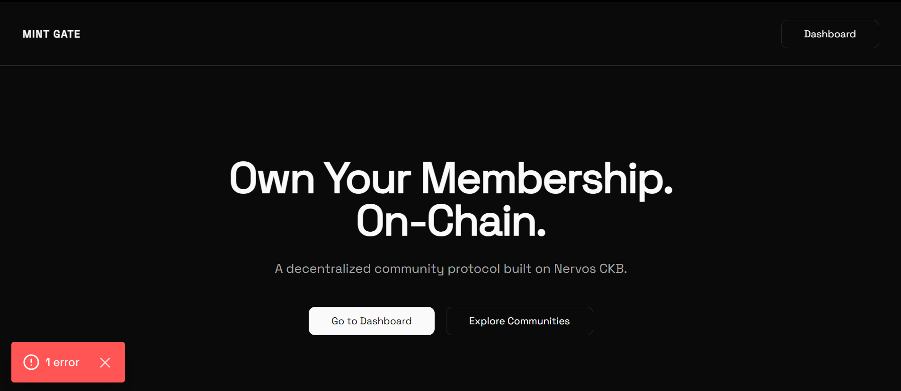
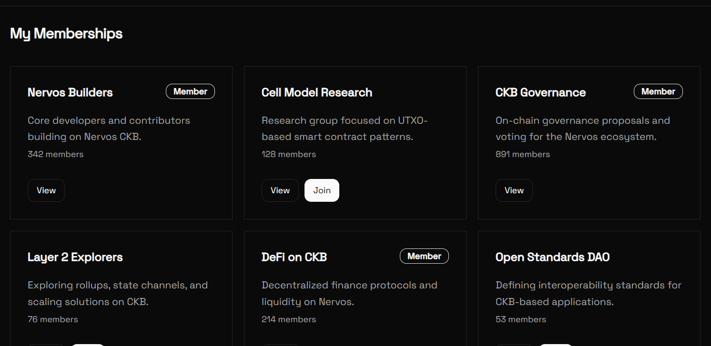

# Builder Track Weekly Report — Week 10

__Name:__ Victor Okenwa.
__Week Ending:__ Friday March 6th, 2026

## Choosing my MVP and building my basic interface

Since the Platform could be very broad and could take a lot of time to build. I decided to choose some tradeoffs and what is basic to what I am building. 

__This is the details of my MVP.__

- User can connect wallet
- User can create a community with these fields
    - Community Name
    - Community Description
    - Memebership Guidlines and rules
    - Hidden URL/Link to a private community e.g discord/telegram
    - Mint Price which is the price a user would pay to become a member.
- Users can view communities.
- Users can Join communities having paid the mint price.

This made me to have a basic approach to what I am building.

I also took in future consideration like:
- Community moderation/limited number of members
- UDT defined members where a user must a community specific token to be called a member.
- Admin controls.
- e.t.c

Now I staterted the basic designs including routes, pages and forms. It wansn't perfect at first but I iterated.

These are some of the designs I could come up with:

__Home Page__

__User's Dashborad with the list of communities created by the user and ones joined__

__Form to Create community__

