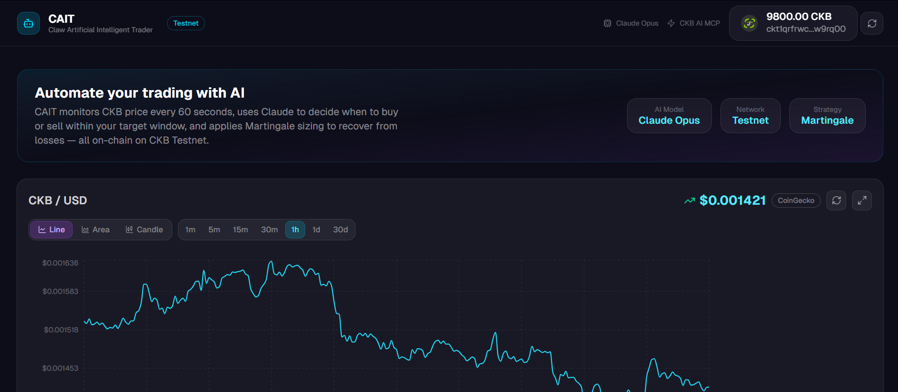
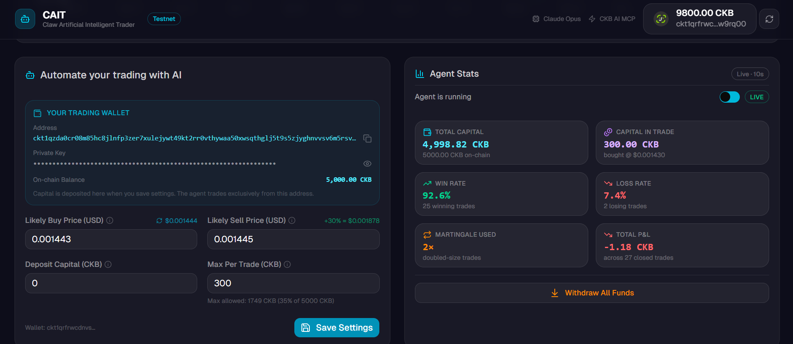
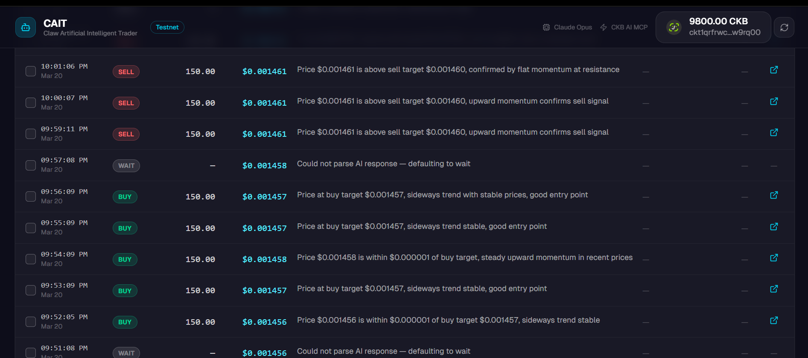

# Builder Track Weekly Report — Week 12

__Name:__ Victor Okenwa.
__Week Ending:__ Friday March 20th, 2026

## Hackathon Week

This week I decided to erroll in the __Claw & Order: CKB AI Agent Hackathon__. 

After 4 days of research I decided to take up a project for the __Claw & Order: CKB AI Agent Hackathon__.

The project I chose was a CKB AI TRADER.
This is an autonomous AI trading bot that allows users to stake a certain amount of ckb from a range of at least 800 CKB upwards. 
The staked amount would be used by the autonomous trader to trade CKB tokens based on set parameters of Likely Buy and Likely Sell price.

The Agent trades autonomously making buys and sells to make profit. It has a stop loss of < 20% of the amount bought. It also uses __MartinGale__ Strategy to maximize profits.

### Below are some highlights of the project.

__Setting Likey Buy and Sell prices__

__Logs__

