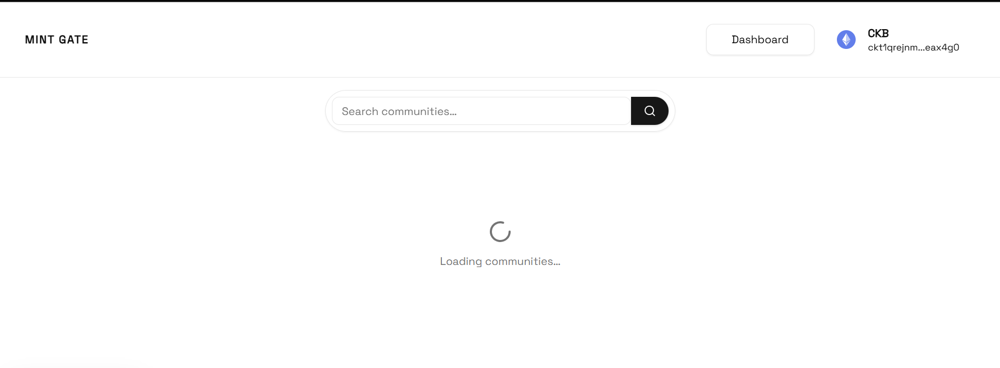
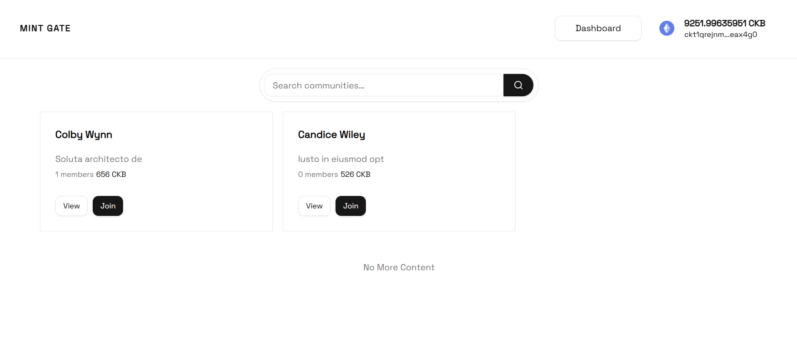
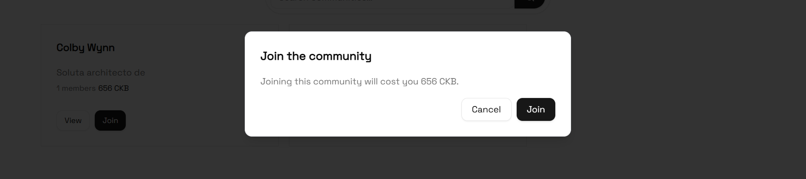
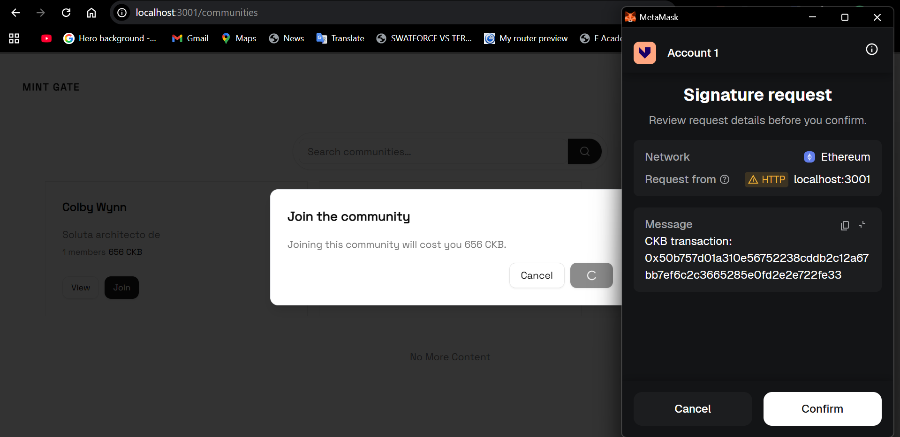

# Builder Track Weekly Report — Week 15

__Name:__ Victor Okenwa.
__Week Ending:__ Friday April 11th, 2026

## Fetch Communities and Wire Community Join (Ckb + Api).

Community join is wired end-to-end: the join button now validates the wallet, builds and completes a CKB payment to the creator, sends the transaction, records membership via a new POST /api/community/join-community route, shows loading and toasts. The communities list passes communityId into the join button. The old app/community/[id]/page.tsx route was removed in favor of a public-route layout under app/(public)/community/[id]/. Navigation shows Dashboard and Connect wallet together when the user is connected.

### Some Snapshots

