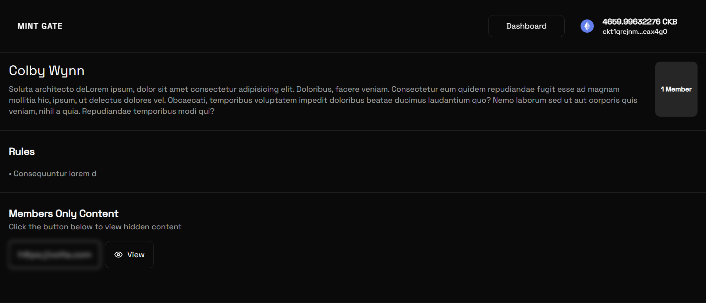

# Builder Track Weekly Report — Week 16

__Name:__ Victor Okenwa.
__Week Ending:__ Friday April 17th, 2026

## Community details page and Cleaning Join community.

During the week, I worked on allowing users to view community details which includes `name`, `description`, `rules/guidelines`, `number of members`, and the `hidden content`.
I managed to fix some bugs plaging the Join community endpoint. 

Their are still some flaws with the design, especially with some secutrity and scrunity issues, but I managed to notice them and make plans to catch and resolve them.

I found out that the user address was not being passed correctly as I sent data to the `Join Community` endpoint. The data being sent to the endpoint as user address was an empty object `{}` because the statement lacked an await expression.

```typescript
    const response = await fetch("/api/community/join-community", {
                method: "POST",
                body: JSON.stringify({
                    community_id: communityId,
                    user_address: signer?.getRecommendedAddress(),
                    tx_hash: txHash,
                }),
    })
```
I fixed this by adding add user address object in my app context so I do not have to get user address individually in each component/page, instead we now have a general control and a single call.

```tsx
"use client";

import { ccc } from "@ckb-ccc/connector-react";
import { createContext, Dispatch, SetStateAction, useContext, useEffect, useState, type JSX, type ReactNode } from "react";

interface CCCType {
    isOpen: boolean;
    open: () => unknown;
    close: () => unknown;
    disconnect: () => unknown;
    setClient: (client: ccc.Client) => unknown;
    client: ccc.Client;
    wallet?: ccc.Wallet;
    signerInfo?: ccc.SignerInfo;
}

interface AppContextType {
    cccClient: CCCType;
    signer: ccc.Signer | undefined;
    userAddress: string
    setUserAddress: Dispatch<SetStateAction<string>>

    isConnected: boolean;
    setIsConnected: React.Dispatch<React.SetStateAction<boolean>>;

    // Add other methods/values to context interface
}


interface AppProviderProps {
    children: ReactNode;
}

const AppContext = createContext<AppContextType | undefined>(undefined);

export default function AppProvider({ children }: AppProviderProps): JSX.Element {
    const cccClient = ccc.useCcc();
    const signer = ccc.useSigner();

    const [isConnected, setIsConnected] = useState(false);
    const [userAddress, setUserAddress] = useState("")


    useEffect(() => {
        if (!signer) return;
        async function checkIsConnectedAndAddAddress() {
            const isSigned = await signer?.isConnected();
            setIsConnected(isSigned || false);

            if (!isSigned) return;

            const address = await signer?.getRecommendedAddress();
            setUserAddress(address!);
            console.log(userAddress)

        }
        checkIsConnectedAndAddAddress();
    }, [signer, userAddress]);


    const value: AppContextType = {
        cccClient,
        signer,

        userAddress,
        setUserAddress,
        isConnected,
        setIsConnected,
    };

    return (
        <AppContext.Provider value={value}>
            {children}
        </AppContext.Provider>
    );
}

export function useApp(): AppContextType {
    const context = useContext(AppContext);
    if (!context) {
        throw new Error("useApp must be used within a AppProvider");
    }
    return context;
};
```

### Key Informations/Files/Snaphots

__JOIN COMMUNITY ENDPOINT__

```typescript
import { supabaseAdmin } from "@/lib/superbase/server";
import { NextResponse } from "next/server";

export async function POST(req: Request) {
    try {
        const body = await req.json();

        const {
            community_id,
            user_address,
            tx_hash,
        } = body;

        console.log("JOIN COMMUNITY", body)

        const data = await supabaseAdmin.from("members").select("*").eq("community_id", community_id).eq("user_address", user_address).maybeSingle();

        if (data.error) {
            console.log(data.error);
            return NextResponse.json({ error: "Something went wrong" }, { status: 500 });
        }

        if (data.count) {
            return NextResponse.json({ error: "You are already a member of this community" }, { status: 400 });
        }

        const community = await supabaseAdmin.from("communities").select("*").eq("id", community_id).single();

        if (!community) {
            return NextResponse.json({ error: "Community not found" }, { status: 404 });
        }

        const { error } = await supabaseAdmin.from("members").insert([{
            community_id,
            user_address,
            tx_hash,
        }]).select()
            .single();

        if (error) {
            return NextResponse.json({ error: "Failed to join community" }, { status: 500 });
        }

        return NextResponse.json({ message: "Joined community successfully" });

    } catch (error) {
        console.error(error);
        return NextResponse.json({ error: "Internal server error" }, { status: 500 });
    }
}
```

__GET COMMUNITY BY ITS ID__

```typescript
import { supabaseAdmin } from "@/lib/superbase/server";
import { CommunityDetail } from "@/utils/constants";
import { NextResponse } from "next/server";

export async function GET(req: Request) {
    const { searchParams } = new URL(req.url);
    const communityId = (searchParams.get("community_id") ?? "").trim();
    const userAddress = (searchParams.get("user_address") ?? "").trim();

    if (!communityId) {
        return NextResponse.json({ error: "community_id is required" }, { status: 400 });
    }

    const { data: community, error: communityError } = await supabaseAdmin
        .from("communities")
        .select("id, name, description, guidelines, mint_price, creator_address, hidden_link, tx_hash")
        .eq("id", communityId)
        .single();

    if (communityError) {
        if (communityError.code === "PGRST116") {
            return NextResponse.json({ error: "Community not found" }, { status: 404 });
        }
        console.error("getCommunity:", communityError);
        return NextResponse.json({ error: communityError.message }, { status: 500 });
    }

    const [membersResult, userMembershipResult] = await Promise.all([
        supabaseAdmin.from("members").select("community_id").eq("community_id", communityId),
        userAddress
            ? supabaseAdmin
                .from("members")
                .select("id")
                .eq("community_id", communityId)
                .eq("user_address", userAddress)
                .maybeSingle()
            : Promise.resolve({ data: null as { id: string } | null, error: null }),
    ]);

    if (membersResult.error) {
        console.error("getCommunity members count:", membersResult.error);
        return NextResponse.json({ error: membersResult.error.message }, { status: 500 });
    }

    if (userMembershipResult.error) {
        console.error("getCommunity membership:", userMembershipResult.error);
        return NextResponse.json({ error: userMembershipResult.error.message }, { status: 500 });
    }

    console.log(userMembershipResult)

    const payload: CommunityDetail = {
        communityID: String(community.id),
        name: community.name ?? "",
        description: community.description ?? "",
        guidelines: Array.isArray(community.guidelines)
            ? community.guidelines.map((item) => String(item))
            : [],
        mintPrice: Number(community.mint_price ?? 0),
        creatorAddress: community.creator_address ?? "",
        hiddenLink: community.hidden_link ?? null,
        txHash: community.tx_hash ?? null,
        isMember: userMembershipResult.data !== null,
        membersCount: membersResult.data?.length ?? 0,
    };

    return NextResponse.json({ community: payload });
}
```

__JOIN COMMUNITY BUTTON__
```typescript
export function CommunityCardJoinButton({ className, mintPrice, communityId, creatorAddress, ...props }: { className?: ClassValue, mintPrice: number, communityId: string, creatorAddress: string } & HTMLAttributes<HTMLButtonElement>) {
    const [isOpen, setIsOpen] = useState(false);
    const [isLoading, setIsLoading] = useState(false);
    const { cccClient, signer, userAddress } = useApp();

    const router = useRouter();

    const handleJoin = useCallback(async () => {

        try {
            setIsLoading(true);
            if (!signer) {
                toast.error("Connect wallet first");
                return;
            }

            if (!creatorAddress) {
                toast.error("Community creator address not found");
                return;
            }

            if (!communityId) {
                toast.error("Community not found");
                return;
            }

            const { script: toLock } = await ccc.Address.fromString(creatorAddress, cccClient.client);

            const tx = ccc.Transaction.from({
                outputs: [{ lock: toLock }],
                outputsData: [],
            });

            tx.outputs.forEach((output, i) => {
                if (output.capacity > ccc.fixedPointFrom(mintPrice)) {
                    toast.error(`Insufficient balance: ${output.capacity} < ${mintPrice} CKB at ${i}`);
                    return;
                }

                output.capacity = ccc.fixedPointFrom(mintPrice);
            });

            // Complete missing parts for transaction
            await tx.completeInputsByCapacity(signer!);
            await tx.completeFeeBy(signer!, 1000);

            const txHash = await signer?.sendTransaction(tx);

            if (!txHash) {
                toast.error("Failed to join community, try again.");
                return;
            }

            const response = await fetch("/api/community/join-community", {
                method: "POST",
                body: JSON.stringify({
                    community_id: communityId,
                    user_address: userAddress,
                    tx_hash: txHash,
                }),
            });

            if (!response.ok) {
                toast.error(await response.text() ?? "Failed to join community, try again.");
                return;
            }

            setIsOpen(false);
            toast.success("Joined community successfully", {
                duration: 7000,
                action: {
                    label: "View Community",
                    onClick: () => router.replace(`/community/${communityId}`),
                },
            });
            router.replace(`/community/${communityId}`);
        } catch (error) {
            console.error(error);
            toast.error((error as Error).message || "Failed to join community, try again.");
        } finally {
            setIsLoading(false);
        }
    }, [cccClient, mintPrice, creatorAddress, communityId, router, signer]);

    return (
        <AlertDialog open={isOpen} onOpenChange={setIsOpen}>
            <AlertDialogTrigger asChild>
                <Button variant="default" size="sm" className={cn(className)} {...props}>
                    Join
                </Button>
            </AlertDialogTrigger>
            <AlertDialogContent>
                <AlertDialogHeader>
                    <AlertDialogTitle>Join the community</AlertDialogTitle>
                </AlertDialogHeader>
                <AlertDialogDescription>
                    Joining this community will cost you {mintPrice} CKB.
                </AlertDialogDescription>
                <AlertDialogFooter>
                    <AlertDialogCancel>Cancel</AlertDialogCancel>
                    <Button onClick={handleJoin} disabled={isLoading}>
                        <LoadingSwap isLoading={isLoading}>Join</LoadingSwap>
                    </Button>
                </AlertDialogFooter>
            </AlertDialogContent>
        </AlertDialog>
    )
}
```

### Some Snapshots


