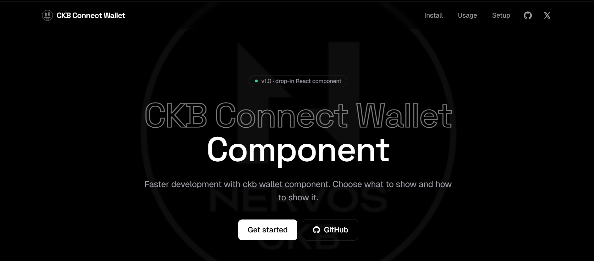
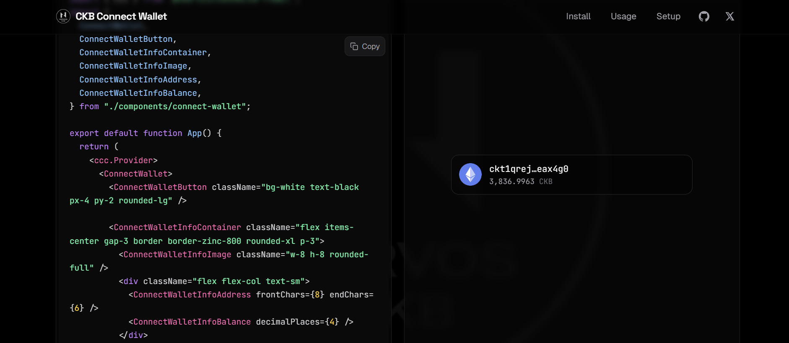

# Builder Track Weekly Report — Week 18

__Name:__ Victor Okenwa.
__Week Ending:__ Friday 1st May, 2026

## Updating and Creating a central demo for the Revamp of the CKB CONNECT WALLET COMPONENT

This week I had to create a demo of my solution for React/CCC developers to ease development and improve simplicity.

I added well detailed steps on how to use the compound component, starting from installing `tailwind merge` and `clsx` down to adding the component to the code base.

I made sure the demo is developer friendly, well documented and self explanatory.





I also updated the connect wallet to be more seemless and having a loading state.

### Here is a summary if the update:

```tsx
    const { open, wallet } = ccc.useCcc();
    const [balance, setBalance] = useState<string>("");
    const [address, setAddress] = useState<string>("");
    const [isLoading, setIsLoading] = useState(false);
    const signer = ccc.useSigner();

    useEffect(() => {
        if (!signer) {
            return
        };
        setIsLoading(true);
        let isMounted = true;

        (async () => {
            try {
                const [address, capacity] = await Promise.all([
                    signer.getRecommendedAddress(),
                    signer.getBalance()
                ]);

                if (isMounted) {
                    setAddress(address);
                    setBalance(ccc.fixedPointToString(capacity));
                    setIsLoading(false)
                }
            } catch (error) {
                console.error('Failed to fetch data:', error);
            }
        })();

        return () => { isMounted = false; };
        }, []);
```

- Added an `isMounted` variable so that address and balance gets updated as soon as the component/page is mounted.
- Added an `isLoading` state that starts as false updates to true while user's details are being fetched and after updates to false. 

__Here is how I implented the loading state by adding an `animate-pulse` to `ConnectWalletButton` and `ConnectWalletInfoContainer`:__

```tsx

export function ConnectWalletButton({
    className = ""
}: {
    className?: ClassValue
}) {
    const { open, wallet, isLoading } = useConnectWallet();

    if (wallet) return null;

    return (
        <button className={cn("cursor-pointer rounded-full border border-solid border-transparent transition-colors flex items-center justify-center gap-2 bg-black dark:bg-white text-white dark:text-black hover:opacity-90  text-sm sm:text-base font-bold  px-5 py-3", className, {
            "animate-pulse": isLoading
        })}
            onClick={open}
        >
            Connect Wallet
        </button>
    )
}

export function ConnectWalletInfoContainer({ children, className = ""
}: {
    children: React.ReactNode;
    className?: ClassValue
}) {
    const { open, wallet, isLoading } = useConnectWallet();

    if (!wallet) return null;
    return (
        <button className={cn("cursor-pointer rounded-full border border-solid border-transparent transition-colors bg-black dark:bg-white text-white dark:text-black hover:opacity-90 text-sm sm:text-base font-bold px-5 py-3", className, {
            "animate-pulse": isLoading
        })}
            onClick={open}>
            {children}
        </button>
    )
}

```


