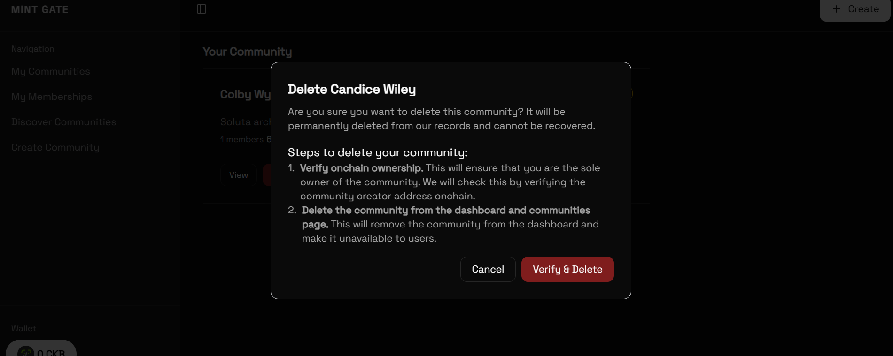

# Builder Track Weekly Report — Week 19

__Name:__ Victor Okenwa.
__Week Ending:__ Friday 7th May, 2026

## Verification and Deletion of Communties on Mint Gate.

During this week I tasked my self with the goal of achieving onchain verification as a single source of truth to derermin the owner of a community especially before deletion.

Although I stored data on my supabased database but it can be mutated and changed but onchain it is immuntable.

The data I stored onchain when a user creates a community is the:
1. Community Id
2. creator address

```ts
{
    id: "68f118dc-5a21-4eda-a058-11ecaf8e9b34",
    creatorAddress: "ckt1qrfrwcdnvssswdwpn3s9v8fp87emat306ctjwsm3nmlkjg8qyza2cqgqqxt7d37lhpzaju02xcajrpgzh0ue8qawqyw9rq00"
}
```

I creator an endpoint to verify ownership by fetching the `Transaction Hash` stored on the database. The endpoint goes to `/verify/community-ownership?{params}`. It takes two parameters:
1. Community Id.
2. User Address.

It first of all fetches the database for the `txHas` then uses CKB `getLiveCell` function to get the output data from then convets it from hext to UTF8 readble format.

__Verify ownershi emdpoint__
```tsx
import { supabaseAdmin } from "@/lib/superbase/server";
import { NextResponse } from "next/server";
import { cccClient } from "@/ccc-client";
import { hexToUtf8 } from "@/lib/ckb/hash";

export async function GET(req: Request) {
    const { searchParams } = new URL(req.url);
    const communityId = (searchParams.get("community_id") ?? "").trim();
    const userAddress = (searchParams.get("user_address") ?? "").trim();

    if (!communityId || !userAddress) {
        return NextResponse.json({ error: "Invalid community id or user address" }, { status: 400 });
    }

    // Get all memberships for the user, paged
    const { data: community, error: fetchError } = await supabaseAdmin
        .from("communities")
        .select("tx_hash")
        .eq("id", communityId)
        .maybeSingle();

    const txHash = community?.tx_hash;
    if (!txHash) return NextResponse.json({ error: "Community not found", verified: false }, { status: 404 });
    if (fetchError) return NextResponse.json({ error: fetchError.message, verified: false }, { status: 500 });

    const cell = await cccClient.getCellLive({ txHash, index: "0x0" }, true)
    const data = hexToUtf8(cell!.outputData)

    // Convert to Javaqscript Object
    const dataToObject = JSON.parse(data)
    if (dataToObject.creatorAddress === userAddress) {
        return NextResponse.json({ txHash, verified: true });
    } else {
        return NextResponse.json({ txHash, verified: false });
    }
}
```

__Convert data from Hex to UTF8 Fucntion__

```ts
export function hexToUtf8(hexString: string): string {
    const decoder = new TextDecoder("utf-8");
    const uint8Array = new Uint8Array(
        hexString.match(/[\da-f]{2}/gi)!.map((h) => parseInt(h, 16))
    );
    return decoder.decode(uint8Array);
}
```

With the above I figured out how to verify user owner before a sensitive action like deletion is done. 

I decided to create an endpoint for deletion which also verifies ownership before a deletion. 

The endpoint works like this:

1. Receive parameters `communityId` and `userAddress` form client.
2. Gets the community `Transaction hash`.
3. Gets the live cells of the `Transaction Hash`.
4. Converts from _Hex_ to _UTF8_.
5. Verifiy ownership.
6. If user is verified as true owner perform deletion on members table by removing and deleting all members details.
7. Safely delete the community and all its records from the database.

__Delete Community endpoint__ 
```ts
import { supabaseAdmin } from "@/lib/superbase/server";
import { NextResponse } from "next/server";
import { cccClient } from "@/ccc-client";
import { hexToUtf8 } from "@/lib/ckb/hash";

export async function DELETE(req: Request) {
    try {
        const { searchParams } = new URL(req.url);
        const communityId = (searchParams.get("community_id") ?? "").trim();
        const userAddress = (searchParams.get("user_address") ?? "").trim();

        if (!communityId || !userAddress) {
            return NextResponse.json({ error: "Invalid community id or user address" }, { status: 400 });
        }

        // Verify ownership by checking blockchain
        const { data: community, error: fetchError } = await supabaseAdmin
            .from("communities")
            .select("tx_hash")
            .eq("id", communityId)
            .maybeSingle();

        if (fetchError) {
            return NextResponse.json({ error: fetchError.message }, { status: 500 });
        }

        const txHash = community?.tx_hash;
        if (!txHash) {
            return NextResponse.json({ error: "Community not found" }, { status: 404 });
        }

        const cell = await cccClient.getCellLive({ txHash, index: "0x0" }, true);
        if (!cell) {
            return NextResponse.json({ error: "Failed to verify ownership" }, { status: 500 });
        }

        const data = hexToUtf8(cell.outputData);
        const dataToObject = JSON.parse(data);

        if (dataToObject.creatorAddress !== userAddress) {
            return NextResponse.json({ error: "You are not the owner of this community" }, { status: 403 });
        }

        // Delete all members first
        const { error: deleteMembersError } = await supabaseAdmin
            .from("members")
            .delete()
            .eq("community_id", communityId);

        if (deleteMembersError) {
            console.error("delete members:", deleteMembersError);
            return NextResponse.json({ error: "Failed to delete community members" }, { status: 500 });
        }

        // Delete the community
        const { error: deleteCommunityError } = await supabaseAdmin
            .from("communities")
            .delete()
            .eq("id", communityId);

        if (deleteCommunityError) {
            console.error("delete community:", deleteCommunityError);
            return NextResponse.json({ error: "Failed to delete community" }, { status: 500 });
        }

        return NextResponse.json({ message: "Community deleted successfully" });

    } catch (error) {
        console.error("delete community error:", error);
        return NextResponse.json({ error: "Internal server error" }, { status: 500 });
    }
}
```

__Communty card Delete button__

```tsx
export function CommunityCardDeleteButton({ className, communityId, communityName, isCreator, ...props }: { className?: ClassValue, communityId: string, communityName: string, isCreator: boolean } & HTMLAttributes<HTMLButtonElement>) {
    const [isOpen, setIsOpen] = useState(false);
    const [isLoading, setIsLoading] = useState(false);
    const { cccClient, signer, userAddress } = useApp();
    const [deleteState, setDeleteState] = useState<'initializing' | 'verifying & deleting' | 'verify & delete'>("verify & delete");

    const router = useRouter();

    const handleDelete = useCallback(async () => {
        try {
            setIsLoading(true);
            setDeleteState("initializing")
            if (!signer) {
                toast.error("Connect wallet first");
                return;
            }

            if (!communityId) {
                toast.error("Community not found");
                return;
            }

            const params = new URLSearchParams({
                community_id: communityId,
                user_address: userAddress
            });

            const controller = new AbortController();
            const timeout = setTimeout(() => controller.abort(), 25_000); // 25 seconds timeout
            setDeleteState("verifying & deleting");

            let res;
            try {
                res = await fetch(`/api/community/delete?${params}`, {
                    signal: controller.signal,
                });
            } finally {
                clearTimeout(timeout);
            }

            const json = await res.json();
            if (!res.ok) throw new Error(json.error ?? "Failed to load communities");

            toast.success("Community deleted successfully")
            router.refresh();

            setIsOpen(false);
        } catch (error) {
            console.log(error as Error);
            toast.error((error as Error).message || "Failed to delete community, try again.");
        }
        finally {
            setIsLoading(false);
            setDeleteState("verify & delete")
        }
    }, [signer, communityId, userAddress, router]);

    if (!isCreator) {
        return null;
    }

    return (
        <AlertDialog open={isOpen} onOpenChange={setIsOpen}>
            <AlertDialogTrigger asChild>
                <Button variant="destructive" size="sm" className={cn(className)} {...props}>
                    Delete
                </Button>
            </AlertDialogTrigger>
            <AlertDialogContent>
                <AlertDialogHeader>
                    <AlertDialogTitle>
                        Delete {communityName}
                    </AlertDialogTitle>
                    <AlertDialogDescription>
                        Are you sure you want to delete this community? It will be permanently deleted from our records  and cannot be recovered.
                    </AlertDialogDescription>
                </AlertDialogHeader>
                <section>
                    <h1>Steps to delete your community:</h1>
                    <ol>
                        <li className="flex items-start gap-2">
                            <span className="text-sm text-muted-foreground">1.</span>
                            <p className="text-sm text-muted-foreground">
                                <b>Verify onchain ownership.</b> This will ensure that you are the sole owner of the community.
                                We will check this by verifying the community creator address onchain.
                            </p>
                        </li>
                        <li className="flex items-start gap-2">
                            <span className="text-sm text-muted-foreground">2.</span>
                            <p className="text-sm text-muted-foreground">
                                <b>Delete the community from the dashboard and communities page.</b> This will remove the community from the dashboard and make it unavailable to users.
                            </p>
                        </li>
                    </ol>
                </section>

                <div className="flex justify-end gap-2">
                    <AlertDialogCancel>Cancel</AlertDialogCancel>
                    <Button variant={"destructive"} onClick={handleDelete} disabled={isLoading} className="capitalize">
                        {isLoading && <Spinner />} {deleteState}
                    </Button>
                </div>
            </AlertDialogContent>
        </AlertDialog>
    )
}
```


