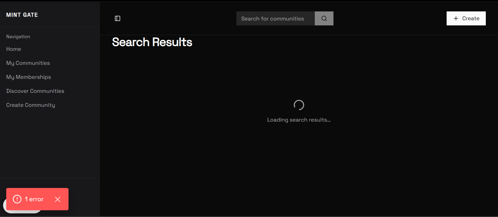

# Builder Track Weekly Report — Week 21

__Name:__ Victor Okenwa.
__Week Ending:__ Friday 21st May, 2026


## Implementing Searching and Search Results and also fixing issues that forces brwakdown on prodiction (Vercel).

This week was a challenging week. I implemented the most fearsome part of my application: _THE SEARCH_.

The search allows users to search communities by name. The search takes on two search parameters 

__1. Search Value__
This is the text/hint of what the user wants to find.

__2. User Address__
This is the signed address of the user. It is an optional param: this allows users who havent connected they wallets to search for commmnuities.




```typescript
// endpoint for search

import { supabaseAdmin } from "@/lib/superbase/server";
import { NextResponse } from "next/server";
import { CommunityListItem } from "../get-all/route";

export async function GET(req: Request) {
    const { searchParams } = new URL(req.url);
    const searchValue = (searchParams.get("search") ?? "").trim();
    const userAddress = (searchParams.get("user_address") ?? "").trim();
    const page = Math.max(1, Number(searchParams.get("page")) || 1);
    const limit = Math.max(1, Math.min(100, Number(searchParams.get("limit")) || 10));

    if (!searchValue) {
        return NextResponse.json({ error: "search is required" }, { status: 400 });
    }

    const from = (page - 1) * limit;
    const to = from + limit - 1;

    const { data: communities, error: communitiesError } = await supabaseAdmin
        .from("communities")
        .select("id, name, description, mint_price, creator_address")
        .ilike("name", `%${searchValue}%`)
        .range(from, to);

    if (communitiesError) {
        console.error("search communities:", communitiesError);
        return NextResponse.json({ error: communitiesError.message }, { status: 500 });
    }

    const communitiesList = communities ?? [];
    const ids = communitiesList.map((c) => String(c.id));

    const membersCountByCommunity = new Map<string, number>();
    const membershipIds = new Set<string>();

    if (ids.length > 0) {
        const [allMembersResult, userMembershipResult] = await Promise.all([
            supabaseAdmin.from("members").select("community_id").in("community_id", ids),
            userAddress
                ? supabaseAdmin
                    .from("members")
                    .select("community_id")
                    .eq("user_address", userAddress)
                    .in("community_id", ids)
                : Promise.resolve({ data: null as { community_id: string }[] | null, error: null }),
        ]);

        if (allMembersResult.error) {
            console.error("search members counts:", allMembersResult.error);
            return NextResponse.json({ error: allMembersResult.error.message }, { status: 500 });
        }

        for (const m of allMembersResult.data ?? []) {
            const cid = String(m.community_id);
            membersCountByCommunity.set(cid, (membersCountByCommunity.get(cid) ?? 0) + 1);
        }

        if (userAddress) {
            if (userMembershipResult.error) {
                console.error("search membership:", userMembershipResult.error);
                return NextResponse.json({ error: userMembershipResult.error.message }, { status: 500 });
            }
            for (const m of userMembershipResult.data ?? []) {
                membershipIds.add(String(m.community_id));
            }
        }
    }

    const payload: CommunityListItem[] = communitiesList.map((row) => {
        const id = String(row.id);
        return {
            communityID: id,
            name: row.name ?? "",
            description: row.description ?? "",
            mintPrice: Number(row.mint_price ?? 0),
            creatorAddress: row.creator_address ?? "",
            isCreator: row.creator_address === userAddress,
            isMember: userAddress ? membershipIds.has(id) : false,
            membersCount: membersCountByCommunity.get(id) ?? 0,
        };
    });

    return NextResponse.json({ communities: payload });
}
```

```tsx
// search results page

"use client";

import { CommunityListItem } from "@/app/api/community/get-all/route";
import {
    CommunityCard,
    CommunityCardActions,
    CommunityCardDescription,
    CommunityCardHeader,
    CommunityCardJoinButton,
    CommunityCardMemberCount,
    CommunityCardMintPrice,
    CommunityCardViewButton,
} from "@/components/community-card";
import { useApp } from "@/components/providers/app-provider";
import { Button } from "@/components/ui/button";
import { Spinner } from "@/components/ui/spinner";
import { PAGE_SIZE } from "@/utils/constants";
import { useCallback, useEffect, useRef, useState } from "react";

export default function SearchPage() {
    const [search, setSearch] = useState("");
    const [initialSearch, setInitialSearch] = useState("");
    const [items, setItems] = useState<CommunityListItem[]>([]);
    const [page, setPage] = useState(1);
    const [initialLoading, setInitialLoading] = useState(false);
    const [loadingMore, setLoadingMore] = useState(false);
    const [hasMore, setHasMore] = useState(true);
    const [error, setError] = useState<string | null>(null);
    const { userAddress } = useApp();
    const loadingMoreRef = useRef(false);

    // Read search param from URL and auto-search
    useEffect(() => {
        const params = new URLSearchParams(window.location.search);
        const searchParam = params.get("search") ?? "";
        if (searchParam.trim()) {
            setInitialSearch(searchParam);
            setSearch(searchParam);
            setInitialLoading(true);
            setError(null);

            const fetchParams = new URLSearchParams({
                search: searchParam,
                page: "1",
                limit: String(PAGE_SIZE),
            });
            if (userAddress) fetchParams.set("user_address", userAddress);

            fetch(`/api/community/search?${fetchParams}`)
                .then(async (res) => {
                    const json = await res.json();
                    if (!res.ok) throw new Error(json.error ?? "Failed to search communities");
                    const batch = json.communities as CommunityListItem[];
                    setItems(batch);
                    setHasMore(batch.length >= PAGE_SIZE);
                })
                .catch((e) => {
                    setError(e instanceof Error ? e.message : "Something went wrong");
                    setItems([]);
                    setHasMore(false);
                })
                .finally(() => {
                    setInitialLoading(false);
                });
        }
    }, [userAddress]);

    const fetchSearchResults = useCallback(async (searchValue: string, currentPage: number, append: boolean) => {
        if (!searchValue.trim()) return;

        try {
            const params = new URLSearchParams({
                search: searchValue,
                page: String(currentPage),
                limit: String(PAGE_SIZE),
            });
            if (userAddress) params.set("user_address", userAddress);

            const controller = new AbortController();
            const timeout = setTimeout(() => controller.abort(), 25_000);

            let res;
            try {
                res = await fetch(`/api/community/search?${params}`, {
                    signal: controller.signal,
                });
            } finally {
                clearTimeout(timeout);
            }

            const json = await res.json();

            if (!res.ok) throw new Error(json.error ?? "Failed to search communities");

            const batch = json.communities as CommunityListItem[];

            if (append) {
                setItems((prev) => [...prev, ...batch]);
            } else {
                setItems(batch);
            }
            setHasMore(batch.length >= PAGE_SIZE);
            setPage(currentPage);
        } catch (e) {
            setError(e instanceof Error ? e.message : "Something went wrong");
            if (!append) {
                setItems([]);
                setHasMore(false);
            }
        }
    }, [userAddress]);

    const loadMore = useCallback(async () => {
        if (!hasMore || initialLoading || loadingMoreRef.current || !search.trim()) return;
        loadingMoreRef.current = true;
        setLoadingMore(true);
        setError(null);
        const nextPage = page + 1;
        try {
            await fetchSearchResults(search, nextPage, true);
        } catch (e) {
            setError(e instanceof Error ? e.message : "Failed to load more");
        } finally {
            loadingMoreRef.current = false;
            setLoadingMore(false);
        }
    }, [hasMore, initialLoading, page, search, fetchSearchResults]);

    const handleRetryFetch = useCallback(() => {
        setError(null);
        // Always retry with search from URL, do an initial fetch if empty, otherwise load more
        if (items.length === 0) {
            // Refetch the first page with the current search (from URL param)
            setInitialLoading(true);
            setPage(1);
            fetchSearchResults(search, 1, false);
        } else {
            void loadMore();
        }
    }, [items.length, loadMore, fetchSearchResults, search]);

    const sentinelRef = useRef<HTMLDivElement>(null);

    useEffect(() => {
        const el = sentinelRef.current;
        if (!el || !hasMore || initialLoading || loadingMore) return;

        const obs = new IntersectionObserver(
            (entries) => {
                if (entries[0]?.isIntersecting) {
                    void loadMore();
                }
            },
            { root: null, rootMargin: "160px", threshold: 0 },
        );
        obs.observe(el);
        return () => obs.disconnect();
    }, [loadMore, hasMore, initialLoading, loadingMore]);

    return (
        <div className="px-4 pb-16 md:px-8">
            <section className="max-w-6xl mx-auto">
                <div className="mb-8">
                    <h1 className="text-3xl font-bold tracking-tight mb-6">Search Results</h1>
                    {/* Search form is intentionally removed */}
                </div>

                {initialLoading ? (
                    <div className="flex flex-col items-center justify-center gap-3 py-24 text-muted-foreground">
                        <Spinner className="size-8" />
                        <span className="text-sm">Loading search results…</span>
                    </div>
                ) : error && items.length === 0 ? (
                    <div className="flex flex-col items-center justify-center gap-4 py-16 px-4">
                        <p className="text-center text-sm text-destructive max-w-md" role="alert">
                            {error}
                        </p>
                        <Button type="button" variant="outline" onClick={handleRetryFetch}>
                            Try again
                        </Button>
                    </div>
                ) : items.length === 0 ? (
                    <p className="text-center text-muted-foreground py-16">
                        No communities found matching &quot;{initialSearch || search}&quot;.
                    </p>
                ) : (
                    <>
                        {error && items.length > 0 && (
                            <div
                                className="mb-6 flex flex-col items-center gap-3 rounded-lg border border-destructive/25 bg-destructive/5 px-4 py-4"
                                role="alert"
                            >
                                <p className="text-center text-sm text-destructive">{error}</p>
                                <Button
                                    type="button"
                                    variant="outline"
                                    size="sm"
                                    onClick={handleRetryFetch}
                                    disabled={loadingMore}
                                >
                                    Try again
                                </Button>
                            </div>
                        )}
                        <div className="grid gap-4 sm:grid-cols-2 lg:grid-cols-3">
                            {items.map((community) => (
                                <CommunityCard key={community.communityID}>
                                    <CommunityCardHeader
                                        title={community.name}
                                        isMember={community.isMember}
                                        isCreator={community.isCreator}
                                    />
                                    <CommunityCardDescription description={community.description} />
                                    <CommunityCardMemberCount count={Number(community.membersCount)} />
                                    &nbsp;
                                    <CommunityCardMintPrice
                                        price={community.mintPrice}
                                        className="text-foreground"
                                    />
                                    <CommunityCardActions>
                                        <CommunityCardViewButton
                                            href={`/community/${community.communityID}`}
                                        />

                                        {!(community.isCreator || community.isMember) && (
                                            <CommunityCardJoinButton
                                                mintPrice={community.mintPrice}
                                                creatorAddress={community.creatorAddress}
                                                communityId={community.communityID}
                                            />
                                        )}
                                    </CommunityCardActions>
                                </CommunityCard>
                            ))}
                        </div>
                    </>
                )}

                {!initialLoading && items.length > 0 && (
                    <div ref={sentinelRef} className="h-4 w-full" aria-hidden />
                )}

                {loadingMore && (
                    <div className="flex flex-col items-center justify-center gap-2 py-10 text-muted-foreground">
                        <Spinner className="size-6" />
                        <span className="text-sm">Loading more…</span>
                    </div>
                )}

                {!initialLoading &&
                    !loadingMore &&
                    !hasMore &&
                    items.length > 0 && (
                        <p className="text-center text-sm text-muted-foreground py-8">
                            No More Content
                        </p>
                    )}
            </section>
        </div>
    );
}
```

```tsx
function SearchForm() {
    const { userAddress } = useApp();
    const searchForm = useForm<SearchSchema>({
        resolver: zodResolver(searchSchema),
        defaultValues: {
            search: ''
        },
    })

    async function handleSearch() {
        const value = searchForm.getValues("search");

        const params = new URLSearchParams({ search: value.trim(), userAddress });
        if (value.trim()) {
            window.location.href = `/search?${params.toString()}`;
        }
    }

    return (
        <Form {...searchForm}>
            <form onSubmit={searchForm.handleSubmit(handleSearch)} className="flex" method="GET">
                <FormField
                    control={searchForm.control}
                    name="search"
                    render={({ field }) => (
                        <FormItem>
                            <FormControl>
                                <Input
                                    placeholder="Search for communities"
                                    className="bg-secondary border-border outline-none! rounded-e-none rounded-s-none"
                                    {...field}
                                />
                            </FormControl>
                        </FormItem>
                    )}
                />
                <Button
                    className="rounded-none"
                    type="submit"
                    disabled={!searchForm.formState.isValid}
                >
                    <SearchIcon />
                </Button>
            </form>
        </Form>
    )

}

function SearchImleplentation() {

    return (
        <div>
            <div className="max-sm:hidden">
                <SearchForm />
            </div>

            <AlertDialog>
                <AlertDialogTrigger asChild className="sm:hidden">
                    <Button className="rounded-none"><SearchIcon /></Button>
                </AlertDialogTrigger>

                <AlertDialogContent className="*:w-full">

                    <AlertDialogHeader>

                        <AlertDialogCancel className="w-fit absolute right-5 top-0">
                            <XIcon />
                        </AlertDialogCancel>

                        <AlertDialogTitle>
                            <h3>Search</h3>
                        </AlertDialogTitle>
                    </AlertDialogHeader>

                    <div className="flex justify-center">
                        <SearchForm />
                    </div>
                </AlertDialogContent>
            </AlertDialog>
        </div>
    )

}
```


