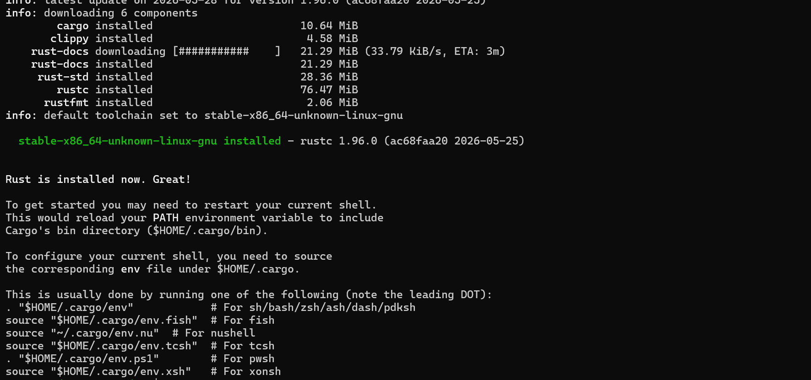

# Builder Track Weekly Report — Week 23

__Name:__ Victor Okenwa.
__Week Ending:__ Friday 4th June, 2026


## Building on CKB with Rust Programing Language

Last week I was learning how to build on `CKB` with `GO` Lang because it as the language I was conversant with.  But after I got suggetsions from the CKB co-ordinator I decided to choose `RUST` because it is the language that CKB supports heavily and it is the best language for Blockchain development because of the way it handles memory (Garbage collector).

I picked up a course on [YouTube](https://www.youtube.com/) to start learning Rust. I picked the up the course because of it's simplicity and detailed approach to learning Rust for developers who are moving to Rust. The tutor of the course also explains how we would we building some projects like __web servers__ and __smart contracts__ with Rust.

I am currently following this [Rust Programming Tutorial for Beginners](https://www.youtube.com/watch?v=R33h77nrMqc&list=PLPoSdR46FgI412aItyJhj2bF66cudB6Qs) on YouTube. This playlist has been very helpful in giving me a good foundation in Rust and shows practical examples relevant to blockchain development for anyone that needs it.

### What is Rust?
Rust is a compiled programming language known for its safety, concurrency and performance. it is a fast and powerful programming language used to build high perfomance systems ad applications like such Operating systems, web servers and smart contracts.

> Rust's package manger is `cargo`.

### Rust memory handling
 Rust does not have a `garbage collector`. A `Garbage collector` is a system that automatically frees up unused memory in a program.

 Now Rust handles Memory freeing and allocation differently in the sense that it allows the developers to configure they won way of garbage collection or it checks what needs to be freed in memory and what shat should remain.


### How to install Rust on Windows Subsystem for Linux

On windows, to use RUST you have to downlaod and install Windows C++ build tools which is heavy and fills alot of disk space. So I decided to use Rust on WSL which frees me of such task and makes things easier.

To install Rust all you need is a single comman
```bash
curl --proto '=https' --tlsv1.2 -sSf https://sh.rustup.rs | sh
```

This will install `rustc`, `clippy`, `cargo`, `rustfmt`, `rust-docs`, `rust-std` e.t.c.

This are all the tools we need to start building with `Rust`.





### My first Rust code

After installation opened a new folder for Rust and called it `rust-hello-world` then I created a file `main.rs` (Rust files have the __.rs__ extension), then I wrote the code below.

```rs
fn main(){
 println!("Hello World");

 std::thread::sleep(std::time::Duration::from_secs(10))
}
```

The code above is just a simple Rust function that outputs `Hello World` and after 3 seconds the program stops

__Result__

```bash
morse-code@morse-code:~/projects/rust-hello-world$ rustc main.rs
morse-code@morse-code:~/projects/rust-hello-world$ ./main
Hello World
```

The `rustc main.rs` compiles my `main.rs` into an executable file. Then we can run the main.rs using the `./main` command.

---
__NOTE__: I tried running this code without the exclamation in the println function and got this error:

```ts
morse-code@morse-code:~/projects/rust-hello-world$ rustc main.rs
error[E0423]: expected function, found macro `println`
 --> main.rs:2:2
  |
2 |  println("Hello World");
  |  ^^^^^^^ not a function
  |
help: use `!` to invoke the macro
  |
2 |  println!("Hello World");
  |         +

error: aborting due to 1 previous error

For more information about this error, try `rustc --explain E0423`.
```

The `!` exclamation mark is for optimization and performance. I don't have the details and use cases of it yet, but hopefully I will grapse it further in the course.


### Rust with Cargo
I delved deeper and started learning how to use cargo for rust development and management.

__Some simple cargo commands__

```bash
 cargo new hello_world
    Creating binary (application) `hello_world` package
```

The code above create a new directory with the cargo workspace initialized.

```bash
cargo build
   Compiling rust-hello-world v0.1.0 (/home/morse-code/projects/rust-hello-world)
    Finished `dev` profile [unoptimized + debuginfo] target(s) in 0.86s
```

The `cargo build` command is used to compile our workspace into an executable file for production.

```bash
 cargo run
    Finished `dev` profile [unoptimized + debuginfo] target(s) in 0.05s
     Running `target/debug/hello_world`
Hello, world!
```

This command is used to compile and run our code.

```bash
cargo check
    Finished `dev` profile [unoptimized + debuginfo] target(s) in 0.12s
```

```bash
cargo check
    Checking hello_world v0.1.0 (/home/morse-code/projects/rust-hello-world/hello_world)
error: cannot find macro `printn` in this scope
  --> src/main.rs:2:5
   |
 2 |     printn!("Hello, world!");
   |     ^^^^^^
   |
  ::: /home/morse-code/.rustup/toolchains/stable-x86_64-unknown-linux-gnu/lib/rustlib/src/rust/library/std/src/macros.rs:85:1
   |
85 | macro_rules! print {
   | ------------------ similarly named macro `print` defined here
   |
help: a macro with a similar name exists
   |
 2 -     printn!("Hello, world!");
 2 +     print!("Hello, world!");
   |

error: could not compile `hello_world` (bin "hello_world") due to 1 previous error
```

The `cargo check` command is used to to check if a workspace could compile and is free of errors.

