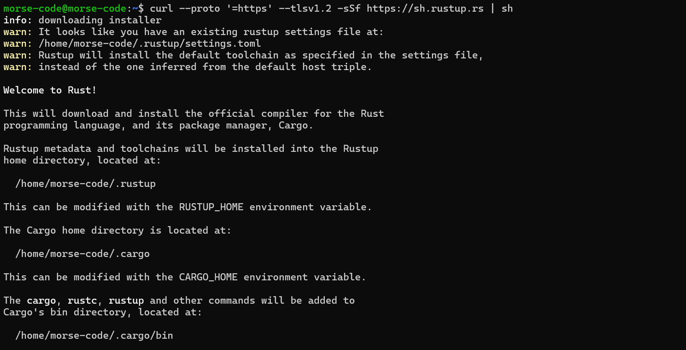
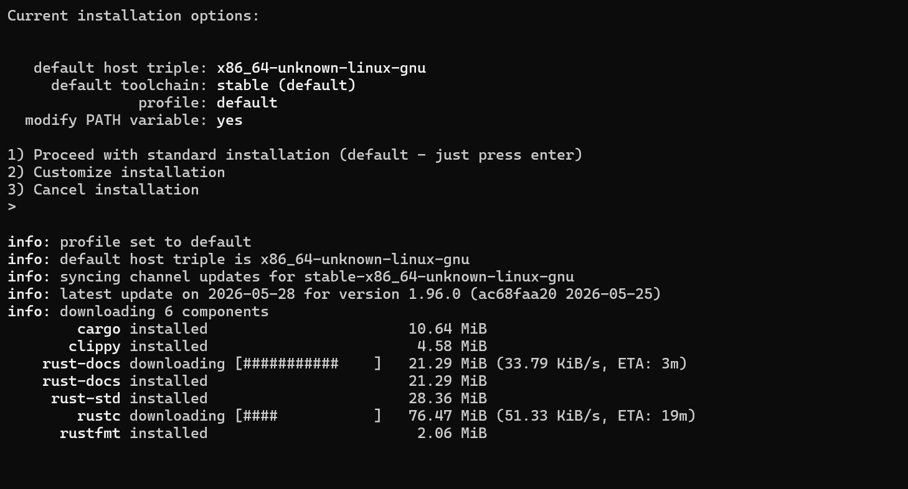

# Builder Track Weekly Report — Week 23

__Name:__ Victor Okenwa.
__Week Ending:__ Friday 4th June, 2026


## Building on CKB with Rust Programing Language

Last week I was learning how to build on `CKB` with `GO` Lang because it as the language I was conversant with.  But after I got suggetsions from the CKB co-ordinator I decided to choose `RUST` because it is the language that CKB supports heavily and it is the best language for Blockchain development because of the way it handles memory (Garbage collector).

I picked up a course on [YouTube](https://www.youtube.com/) to start learning Rust. I picked the up the course because of it's simplicity and detailed approach to learning Rust for developers who are moving to Rust. The tutor of the course also explains how we would we building some projects like __web servers__ and __smart contracts__ with Rust.

I am currently following this [Rust Programming Tutorial for Beginners](https://www.youtube.com/watch?v=R33h77nrMqc&list=PLPoSdR46FgI412aItyJhj2bF66cudB6Qs) on YouTube. This playlist has been very helpful in giving me a good foundation in Rust and shows practical examples relevant to blockchain development for anyone that needs it.

### What is Rust?
Rust is a compiled programming language known for its safety, concurrency and performance. it is a fast and powerful programming language used to build high perfomance systems ad applications like such Operating systems, web servers and smart contracts.

> Rust's package manger is `cargo`.

### Rust memory handling
 Rust does not have a `garbage collector`. A `Garbage collector` is a system that automatically frees up unused memory in a program.

 Now Rust handles Memory freeing and allocation differently in the sense that it allows the developers to configure they won way of garbage collection or it checks what needs to be freed in memory and what shat should remain.


### How to install Rust on Windows Subsystem for Linux

On windows, to use RUST you have to downlaod and install Windows C++ build tools which is heavy and fills alot of disk space. So I decided to use Rust on WSL which frees me of such task and makes things easier.

To install Rust all you need is a single comman
```bash
curl --proto '=https' --tlsv1.2 -sSf https://sh.rustup.rs | sh
```

This will install `rustc`, `clippy`, `cargo`, `rustfmt`, `rust-docs`, `rust-std` e.t.c.

This are all the tools we need to start building with `Rust`.


