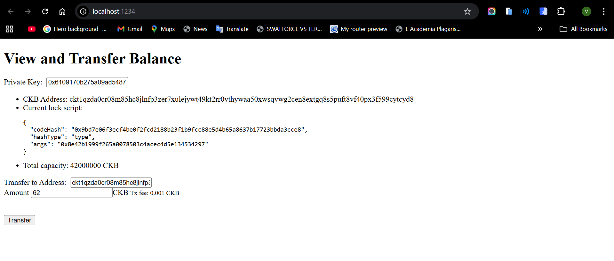
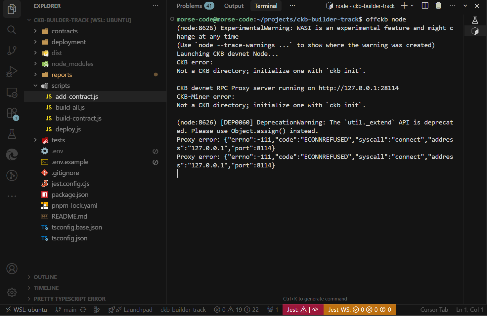
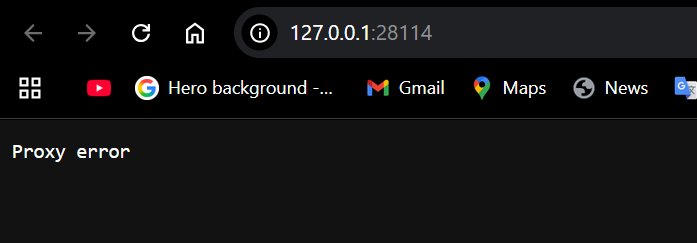
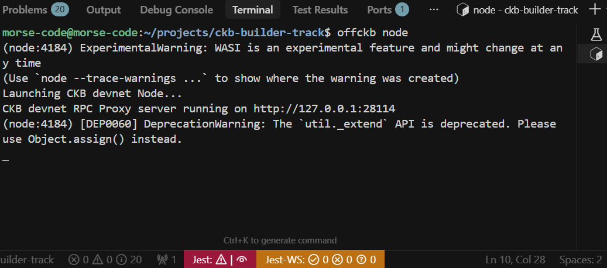
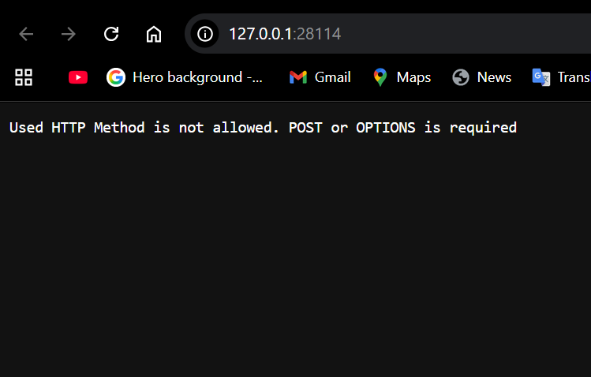

# Builder Track Weekly Report — Week 3

__Name:__ Victor Okenwa.
__Week Ending:__ Friday 15th, 2026

# View and Transfer a CKB Balance

During this course I did the following:

- I pulled the code from this [REPOSITORY](https://github.com/nervosnetwork/docs.nervos.org)
- Then I navigated into the transfer example directory `cd examples/dApp/simple-transfer`.
- I started the ckb RPC server `offckb node`.

```bash
offckb node
(node:17619) ExperimentalWarning: WASI is an experimental feature and might change at any time
(Use `node --trace-warnings ...` to show where the warning was created)
Launching CKB devnet Node...
CKB devnet RPC Proxy server running on http://127.0.0.1:28114
```

- I ran `pnpm install` to install the all dependencies.
- Then I ran `NETWORK=devnet npm start` to start the dev server.
```bash
NETWORK=devnet pnpm start

> @offckb/simple-transfer@0.1.0 start /home/morse-code/projects/docs.nervos.org/examples/dApp/simple-transfer
> parcel index.html

Server running at http://localhost:1234
✨ Built in 5.96s
```



## Challenges faced

The first time I ran `offckb node` i got a warning that states the current directory is not a ckb directory and an error. Below is an image of the response i got:




## Solution (from the ckb community)

1. I killed the current `offckb` RPC server running.
2. I ran the `offckb config list`.
3. I located the `devnet.configPath`.
4. I navigated to the directory on my file explorer and deleted the devnet directory.
5. Then I ran `offckb clean` and restarted the server again using `offckb node`.
6. Then I got the newest block number by running:
   
```bash
echo '{
    "id": 2,
    "jsonrpc": "2.0",
    "method": "get_tip_block_number",
    "params": []
}' \
| tr -d '\n' \
| curl -H 'content-type: application/json' -d @- \
http://localhost:28114
```

Response

```bash
{"jsonrpc":"2.0","result":"0xdf3","id":2}
```

 
 
