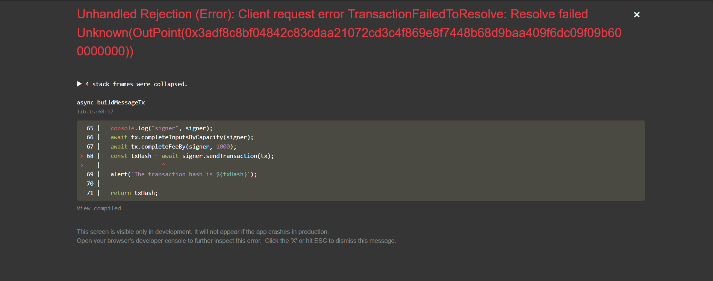

# Builder Track Weekly Report — Week 3

__Name:__ Victor Okenwa.
__Week Ending:__ Friday 23rd, 2026

# Store Data in a Cell

I learnt how data can be stored in a in cell. I stored a simple "HELLO WORLD" message in a cell and I also read the cell.

## Issues Faced

When I clicked the write button, i was greeted with an error:

## How I fixed it

