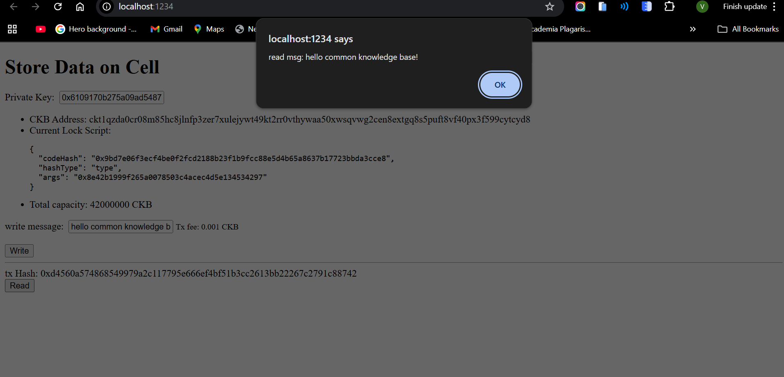
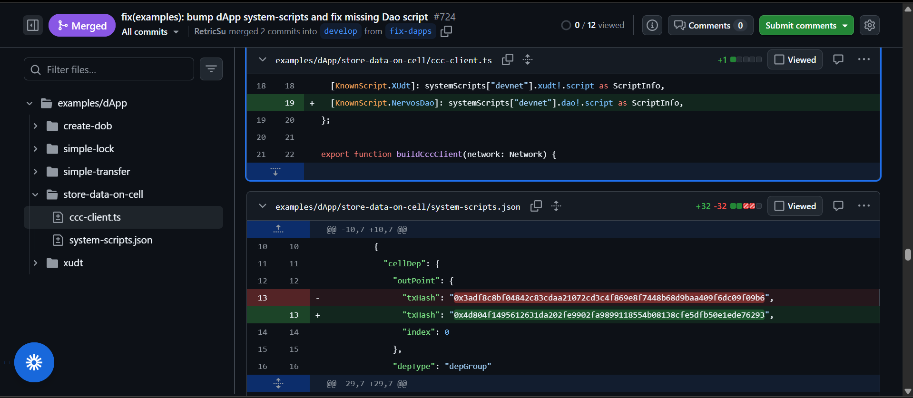

# Builder Track Weekly Report — Week 3

__Name:__ Victor Okenwa.
__Week Ending:__ Friday 23rd, 2026

# Store Data in a Cell

I learnt how data can be stored in a in cell. I stored a simple "HELLO WORLD" message in a cell and I also read the cell.

## Issues Faced

When I clicked the write button, i was greeted with an error:

## How I fixed it

I followed the updates from this PR below and updated the changes on two files.

- The examples/dApp/store-data-on-cell/ccc-client.ts
- The examples/dApp/store-data-on-cell/system-scripts.json

[Link to Pull request](https://github.com/nervosnetwork/docs.nervos.org/pull/724/changes#diff-a92815c520fa60c9594f7cba4871a22d5b914016a70330907057dd889fe582c5)

__Note:__ The two files must be updated with the one in the PR or else the error persists. By the time you get this if the PR has been merged to main you might have to __re-clone__ the docs.nervos workspace.