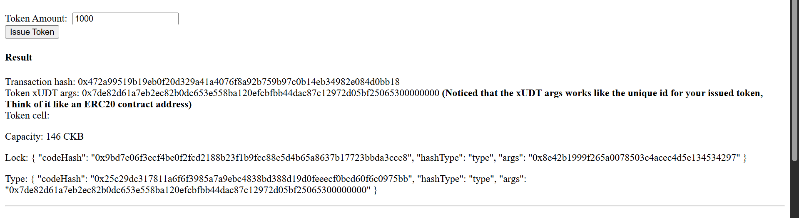
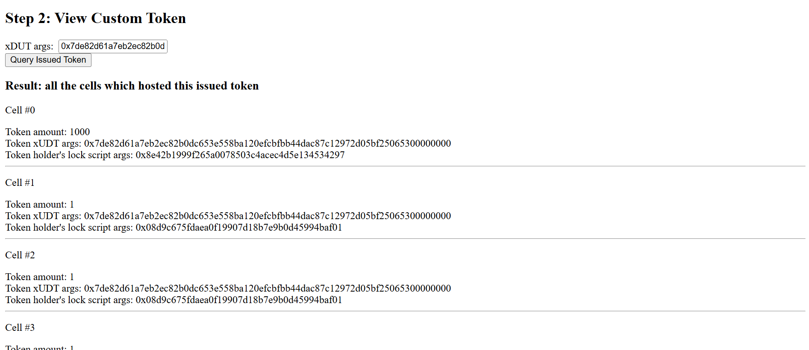
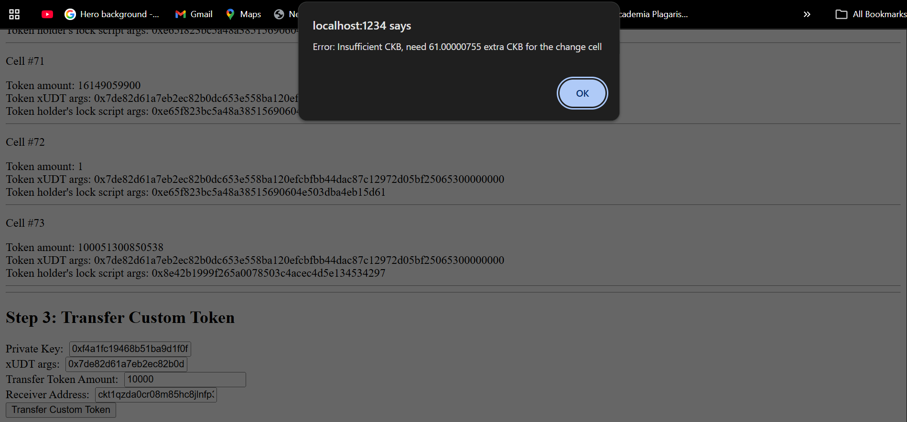
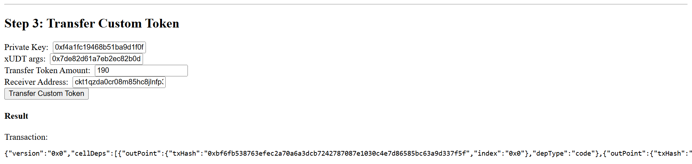

# Builder Track Weekly Report — Week 5

__Name:__ Victor Okenwa.
__Week Ending:__ Thrusday January 29th, 2026

## How to create Fungible tokens

__What is Fungible Tokens?__

Fungible Tokens are digital assets that are interchangeable and has an identical value to every other token of the same type. Examples include _CKB_, _Bitcoin_, _USD_, _Naira_, _GHS_ e.t.c.

Unlike _Ethereum and Bitcoin_, __CKB__ uses the UTXO Cell model which just basically means that once you use something in CKB (in this case a cell) you can't alter it, the only way out is to destroy it and create a new one.

CKB uses this UTXO Cell model to create __custom token__. Custom tokens also know as User-Defined Tokens (UDTs) in CKB are fungible tokens created by a user. CKb has a minimal standard for UDTs which is called __Extensible User-Defined Tokens (xUDTs)__.

## Steps to issue a custom token using xUDT:

1. Create a Special Cell: This just simply means that when you issue your token you create a special box, that box represents some amount of your token.
2. Configure cell's data: The data in the "special cell" will store the token amount. It is just a number. For instance I want to store 1000 of VictorTokens, I have to configure the data to have 1000. The Typescript will be the xUDT script and the Lockscript will hold my Hash as the issuer.
3. Establish a unique Token ID: My Hash stored in the Lock Script would server as a unique Identifier for each of my tokens. This just means that different Lock Script hashed represents different tokens which enables secure and unique transaction for each token type.

## Issued a new Token with amount set to 1000

## Queried my issued token

## I tested by exceeding the amount I issued

## Successful Transfer, transferred 190 units of my token

