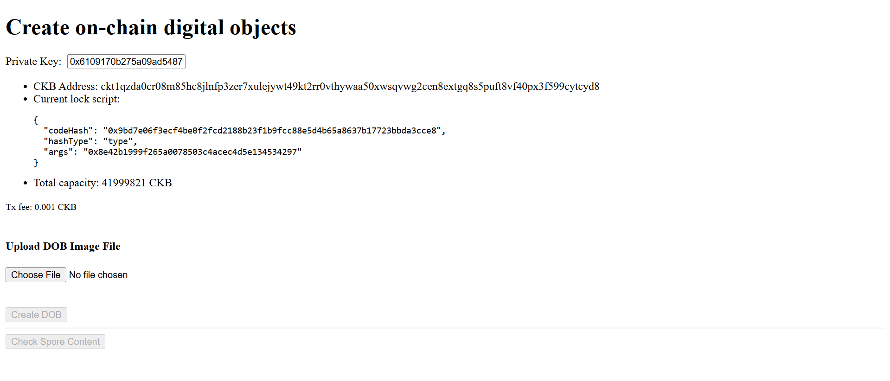
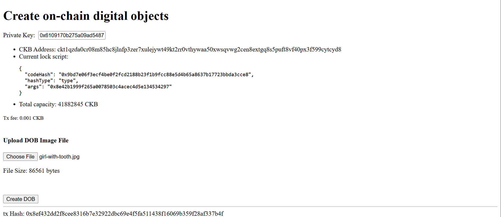
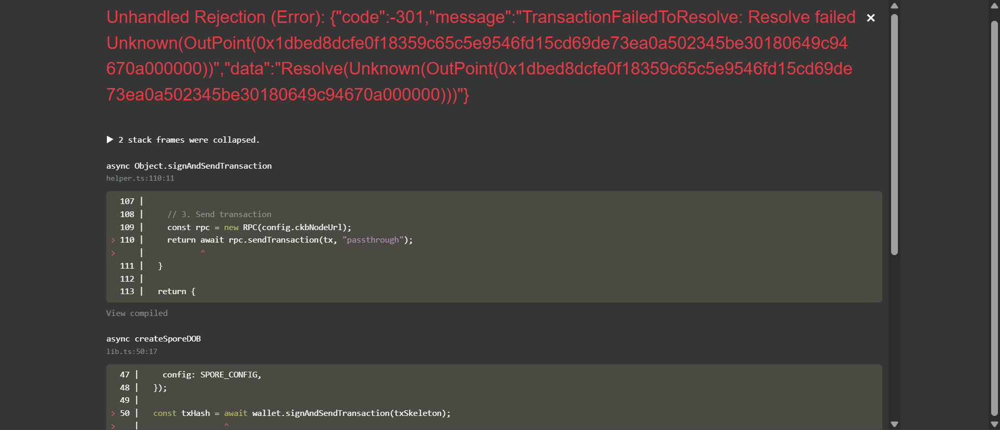
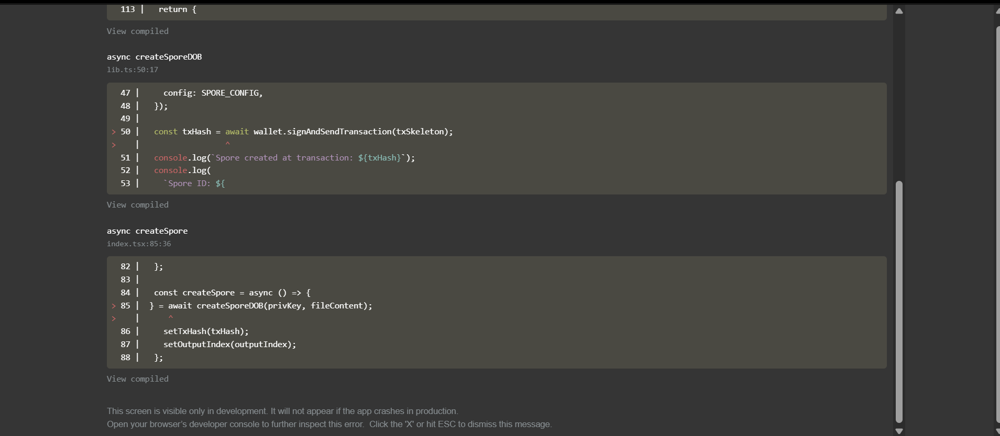

# Builder Track Weekly Report — Week 6

__Name:__ Victor Okenwa.
__Week Ending:__ Wednesday February 4th, 2026

## How to create a Digital Object using Spore protocol

A __DOB__ is an on-chain asset created using the Spore Protocol on the Nervos CKB blockchain.
Spore is an onchain DOB protocol backed by CKB. The Spore Protocol uses a modular design to create DOBs.

A spore cell can hold any type of asset that a user wants to store and this is how a __Spore__  cell looks like:

```py
data:
    content-type: Bytes # String Bytes
    content: Bytes
    cluster_id: Bytes # Optional
type:
    hash_type: "data1"
    code_hash: SPORE_TYPE_DATA_HASH
    args: SPORE_ID
lock:
    <user_defined>
```

- __The Content__ is used to store user defined asset and the __Content Type__ is used to notify the type of content stored. This allows users to store any type of asset in a spore cell.






__Note: All fields in a spore cell are unchangeable (immutable).__


Error Faced:





How to Fix:

Update the `ccc-client.ts`, `system-scripts.json`, and `spore-config.ts` files using this [PR](https://github.com/nervosnetwork/docs.nervos.org/pull/724/changes#diff-b28f6cffdec253881d03c032620edb03f8f083eb17f7aba9ee25e21d91244bcd) 


