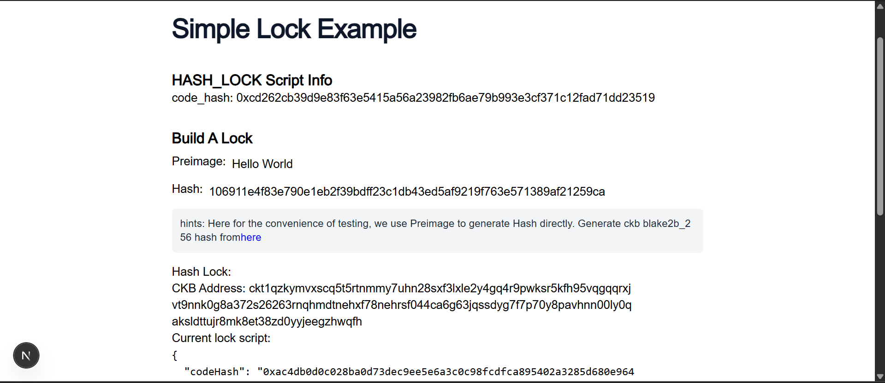
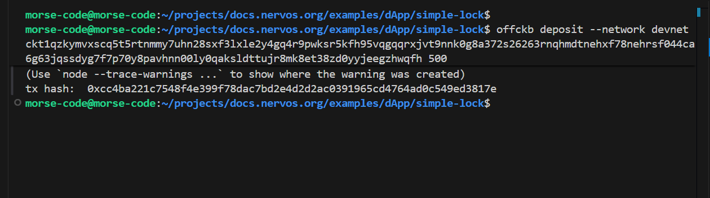
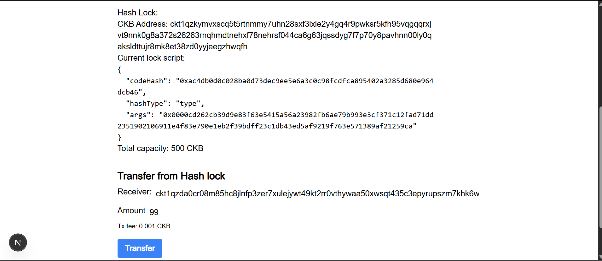
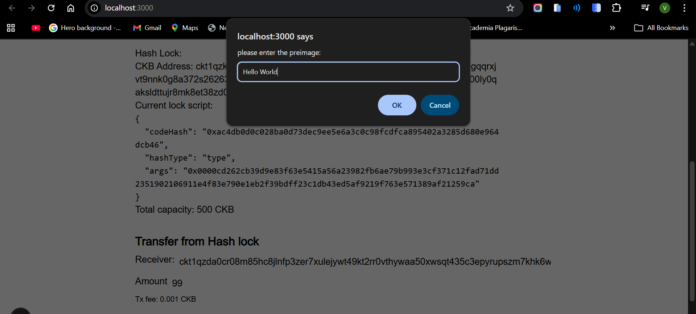
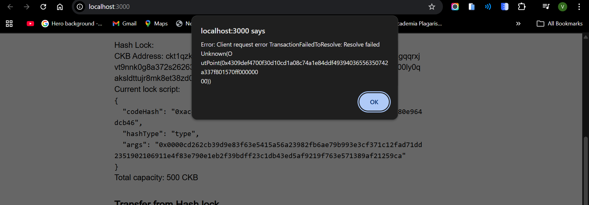
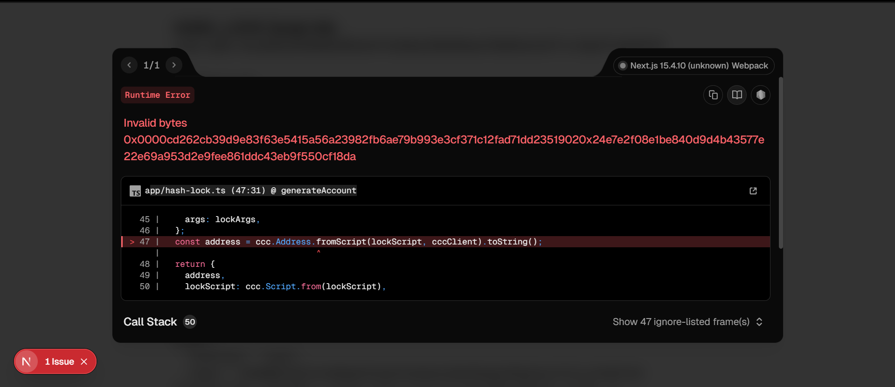
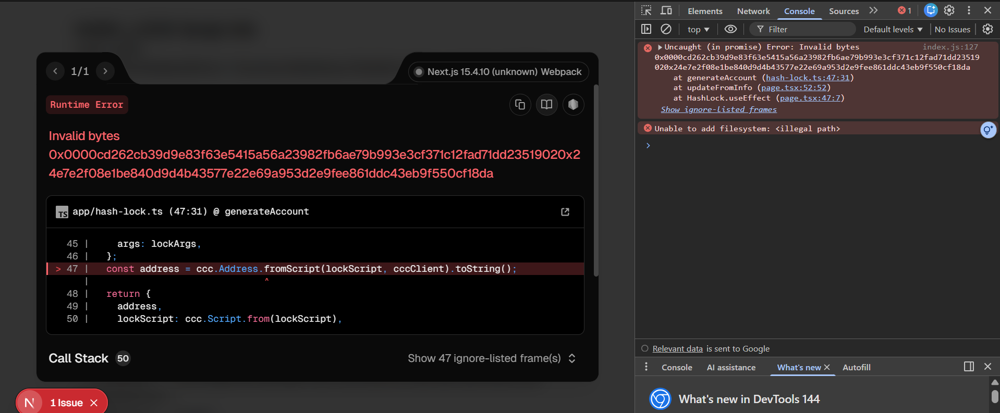

# Builder Track Weekly Report — Week 7

__Name:__ Victor Okenwa.
__Week Ending:__ Wednesday February 11th, 2026

## How to create a Simple lock

Here i learnt how to create a full-stack dApp where the frontend communicates with the script.

We used a dApp that stores some CKB token and secures the token with a Lock Script called `hash_lock`. 

Users can transfer some CKB token but on a condition that they provide the correct pre-image that matches the hash.

Steps I followed to achieve this

### Step 1: Startup the frontend server and load on the browser.


### Step 2: I deposited 500 ckb to the address provided by the Pre-Image (Hello World)


### Step 3: Make the Transfer


### Step 4: Type in the correct pre-image i.e Hello World




__Note that the documentation is outdated so I was asked to skip this and move to the next course. If you have any question about why please to well to communicate to the CKB Nervos community__


## Issues Faces




__The main issue is that the hash provide is not correct I misplaced it with an address__

> I fixed it by changing the pre-image back to `Hello World` then I copied the _CKB Address_ generated then deposited some CKB tokens into it.

```bash
morse-code@morse-code:~/projects/docs.nervos.org/examples/dApp/simple-lock$ offckb deposit --network devnet ckt1qzkymvxscq5t5rtnmmy7uhn28sxf3lxle2y4gq4r9pwksr5kfh95vqgqqrxjvt9nnk0g8a372s26263rnqhmdtnehxf78nehrsf044ca6g63jqssdyg7f7p70y8pavhnn00ly0qaksldttujr8mk8et38zd0yyjeegzhwqfh 500
(node:4542) ExperimentalWarning: WASI is an experimental feature and might change at any time
(Use `node --trace-warnings ...` to show where the warning was created)
tx hash:  0xcc4ba221c7548f4e399f78dac7bd2e4d2d2ac0391965cd4764ad0c549ed3817e
```


