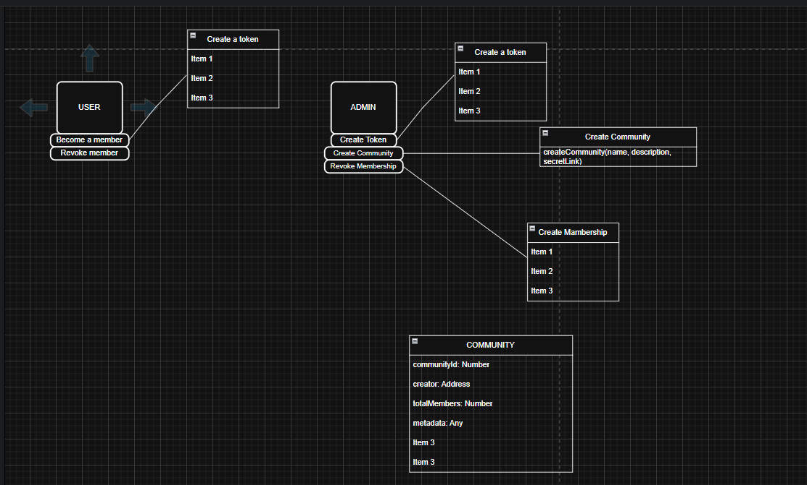

# Builder Track Weekly Report — Week 8

__Name:__ Victor Okenwa.
__Week Ending:__ Friday February 20th, 2026

## Building my own ckb app to test my ckb knowledge.

After learning the ckb fundamentals, it was time for me to get hands on experience on how to use CKB and its tools.

I chose to build an **Onchain Token Gating Platform** as the project that would test my CKB knowledge.

Since I am new to the Blockchain ecosystem I starte to research about token gating and I found out that: 

> Token gating is a Web3 method that restricts access to exclusive content, services, or physical experiences, requiring users to own specific NFTs or tokens.

After My research I started off with some basic system design; how the platform would function.

Here is the High level design

