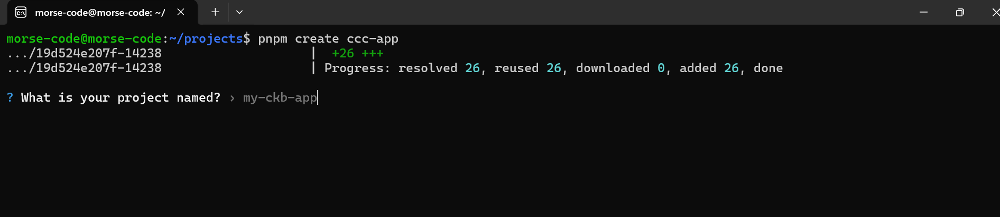
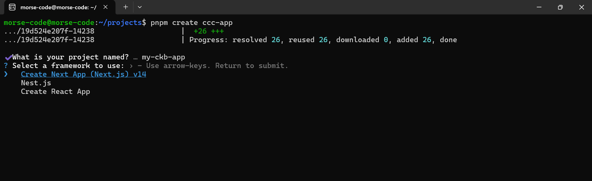
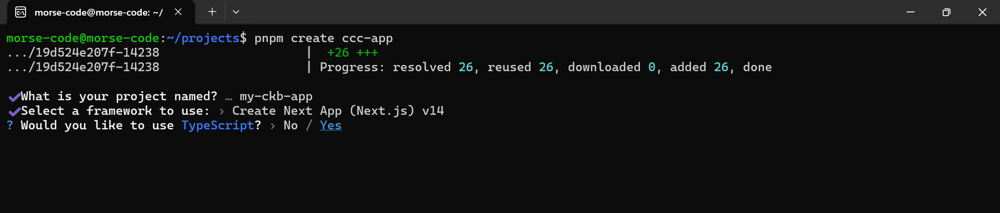
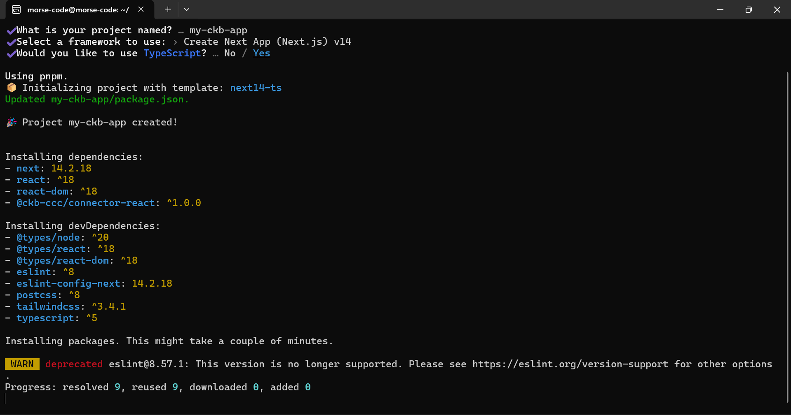
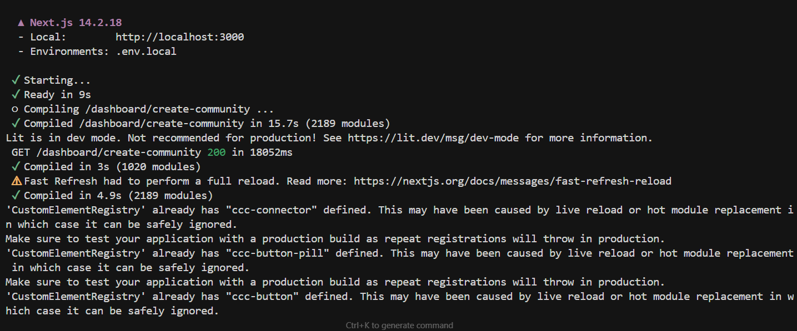
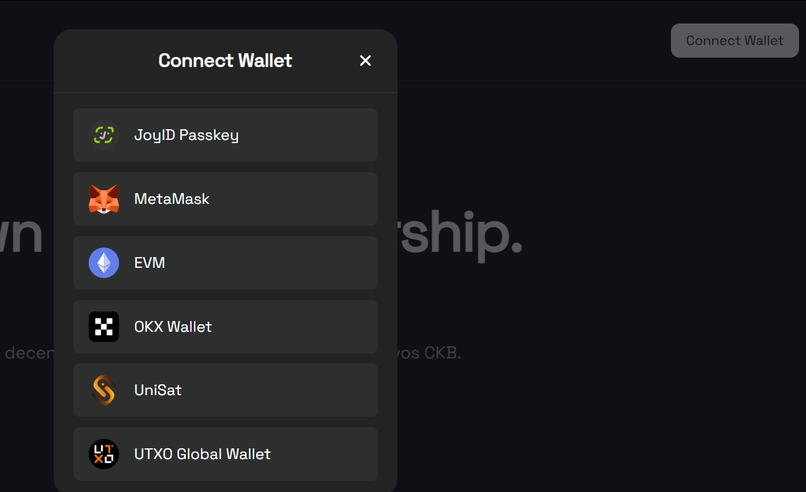
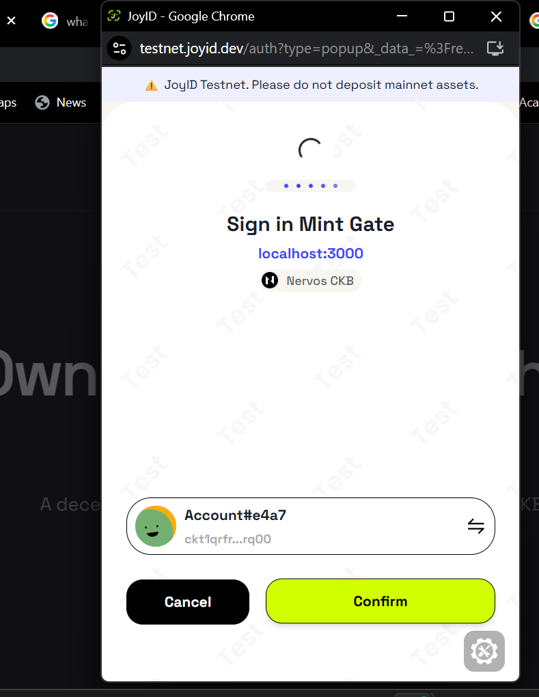

# Builder Track Weekly Report — Week 9

__Name:__ Victor Okenwa.
__Week Ending:__ Friday February 27th, 2026

## Starting a CCC App

CCC which stands for Common Chain Connector is a JavaScript/Typescript SDK tailored for CKB. It makes it easy to JavaScript/Typescript on CKB.

I did more research about a CCC app and how to start one. 

So, after my research I found aout that i could create a CCC app using any of these commands `pnpm create ccc-app` or `npx create ccc-app`.

I chose to use a pnpm workspace and I created one for my token gating platform following these steps:

- First I ran the  `pnpm create ccc-app`

```bash
morse-code@morse-code:~/projects$ pnpm create ccc-app
.../19d524e207f-14238                    |  +26 +++
.../19d524e207f-14238                    | Progress: resolved 26, reused 26, downloaded 0, added 26, done
```

- This prompted me to name my app, i called it `my-ckb-app`




- I was asked to choose a framework for my app and I chose __NEXT.JS 14__ because my app needs backend endpoints.




- I was asked to choose using __TypeScript__ or not, I chose yes because of my proficiency in it.




- All thee needed packages were installed and i had to 

```bash
cd my-ckb-app
  pnpm run dev
```





### Testing wallet connect.

I did some basic testing of the scafolded wallet connect. I connected my wallet and it reflected.





